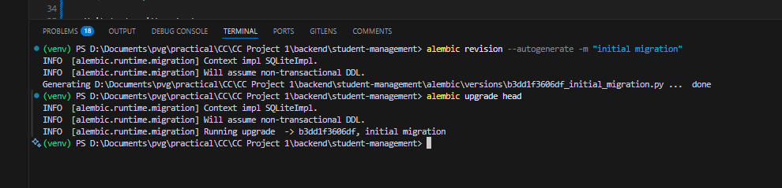

# Student Management API - FastAPI Backend


A secure RESTful API for student and course management with JWT authentication, built with FastAPI and SQLite.

## Features


Alembic Migration


Access Token Creation (JWT)


Insertion of Students by Authenticated User


### 🔒 Authentication & Authorization

- JWT-based authentication (OAuth2 with password flow)
- Protected endpoints for all student and course operations
- Role-based access control (future-ready)
- Password hashing with bcrypt

### 🗃️ Database

- SQLite database with SQLAlchemy ORM
- Async database operations
- Alembic database migrations
- Automatic database initialization

### 📊 API Features

- Full CRUD operations for student and course management
- Enrollment management for students in courses
- Request validation with Pydantic models
- Proper HTTP status codes for all responses
- Pagination support for student listings
- Comprehensive error handling

### 🛠️ Development Tools

- Unit tests with pytest
- In-memory SQLite for testing
- Request/response logging
- Interactive API documentation (Swagger UI & ReDoc)
- CORS middleware enabled

## Tech Stack

- **Framework**: FastAPI
- **Database**: SQLite with SQLAlchemy ORM
- **Authentication**: JWT (OAuth2)
- **Testing**: pytest with FastAPI TestClient
- **Migrations**: Alembic
- **Logging**: Python logging module
- **Validation**: Pydantic

## API Endpoints

| Endpoint                          | Method | Auth Required | Description                    |
| --------------------------------- | ------ | ------------- | ------------------------------ |
| `/token`                          | POST   | No            | Get access token               |
| `/users/`                         | POST   | No            | Create new user                |
| `/students/`                      | POST   | Yes           | Create new student             |
| `/students/`                      | GET    | Yes           | List all students              |
| `/students/{id}`                  | GET    | Yes           | Get student details            |
| `/courses/`                       | POST   | Yes           | Create new course              |
| `/courses/{course_id}`            | GET    | Yes           | Get course details             |
| `/enrollments`                    | POST   | Yes           | Enroll student in course       |
| `/students/{student_id}/courses/` | GET    | Yes           | Get student's enrolled courses |
| `/health`                         | GET    | No            | Health check                   |

## Database Schema


## Getting Started

### Prerequisites

- Python 3.8+
- pip package manager

### Installation

1. Clone the repository:

   ```bash
   git clone https://github.com/Kabeer2004/CCProject1.git
   cd backend/student-management-api/backend/student-management
   ```

2. Create and activate virtual environment:

   ```bash
   python -m venv venv
   source venv/bin/activate  # On Windows: venv\Scripts\activate
   ```

3. Install dependencies:

   ```bash
   pip install -r requirements.txt
   ```

### Configuration

Create a `.env` file:

```env
SECRET_KEY=your-secret-key-here
ALGORITHM=HS256
ACCESS_TOKEN_EXPIRE_MINUTES=30
```

### Database Setup

1. Apply migrations:

   ```bash
   alembic upgrade head
   ```

2. Initialize database (optional):

   ```bash
   python -c "from database import init_db; import asyncio; asyncio.run(init_db())"
   ```

### Running the Server

Start the development server:

```bash
uvicorn main:app --reload
```

The API will be available at `http://localhost:8000`

## Testing

Run the test suite:

```bash
pytest
```

## API Documentation

Interactive documentation is automatically available at:

- Swagger UI: `http://localhost:8000/docs`
- ReDoc: `http://localhost:8000/redoc`

## Example Requests

### Create User

```bash
curl -X POST "http://localhost:8000/users/" \
-H "Content-Type: application/json" \
-d '{"username": "admin", "password": "secret"}'
```

### Get Access Token

```bash
curl -X POST "http://localhost:8000/token" \
-H "Content-Type: application/x-www-form-urlencoded" \
-d "username=admin&password=secret"
```

### Create Student (Authenticated)

```bash
curl -X POST "http://localhost:8000/students/" \
-H "Content-Type: application/json" \
-H "Authorization: Bearer YOUR_TOKEN" \
-d '{"name": "John Doe", "age": 21, "email": "john@example.com"}'
```

### Create Course (Authenticated)

```bash
curl -X POST "http://localhost:8000/courses/" \
-H "Content-Type: application/json" \
-H "Authorization: Bearer YOUR_TOKEN" \
-d '{"title": "Mathematics", "description": "Introduction to Mathematics"}'
```

### Enroll Student in Course (Authenticated)

```bash
curl -X POST "http://localhost:8000/enrollments" \
-H "Content-Type: application/json" \
-H "Authorization: Bearer YOUR_TOKEN" \
-d '{"student_id": 1, "course_id": 1}'
```

### Get Student's Enrolled Courses (Authenticated)

```bash
curl -X GET "http://localhost:8000/students/1/courses/" \
-H "Authorization: Bearer YOUR_TOKEN"
```

## Project Structure

```
student-management/
├── alembic/               # Database migrations
├── tests/                 # Unit tests
├── .env.example           # Environment variables template
├── alembic.ini            # Alembic configuration
├── config.py              # Application configuration
├── crud.py                # Database operations
├── database.py            # Database connection
├── logging_config.py      # Logging setup
├── main.py                # FastAPI application
├── models.py              # SQLAlchemy models
├── requirements.txt       # Dependencies
├── schemas.py             # Pydantic models
└── students.db            # SQLite database
```

## Deployment

For production deployment:

1. Set up a proper database (PostgreSQL recommended)
2. Configure proper secret keys
3. Set up HTTPS
4. Consider using:
   - Gunicorn with Uvicorn workers
   - NGINX as reverse proxy
   - Docker for containerization

---

_Developed as part of the Cloud Computing course - 6th Semester Engineering_
